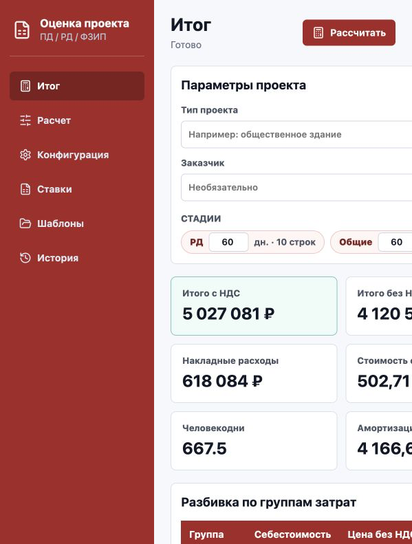
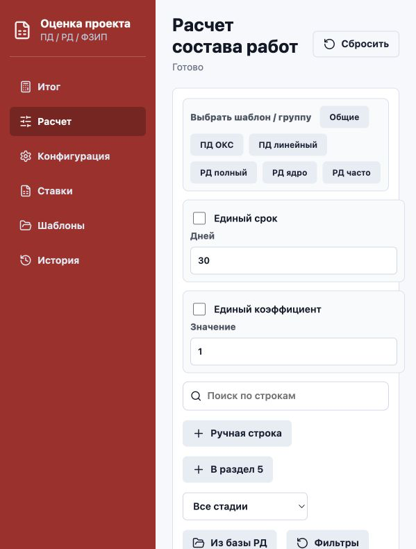
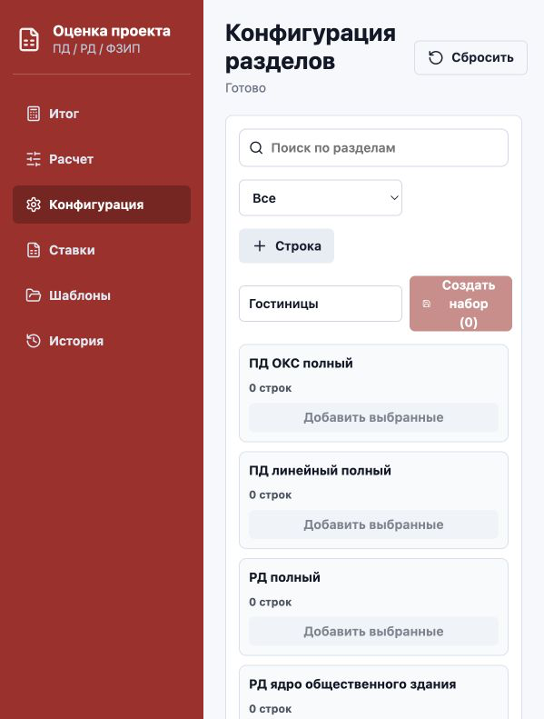

# Калькулятор оценки проекта

Desktop-приложение для оценки стоимости проектных работ ПД / РД / ФЗИП. Приложение сделано на Tauri 2 + React + TypeScript, хранит данные локально и выгружает Excel с формулами.

## Что умеет

- Считать итоговую цену с НДС, цену без НДС, себестоимость ФОТ с НДФЛ, накладные расходы, стоимость за м2, человекодни и прибыль.
- Вести расчет по стадиям: ПД, РД, Общие и пользовательские группы затрат.
- Добавлять строки расчета вручную, добавлять строки в Раздел 5 ПД, добавлять РД из базы.
- Настраивать состав строк: группа ставки, тип расчета, состав команды по ролям, срок, коэффициент, ручная сумма или процент от общего.
- Редактировать ставки как стоимостные группы, включая общий множитель ставок и шаг ролей.
- Создавать и пополнять наборы/шаблоны строк: гостиницы, наружка и любые пользовательские наборы.
- Считать авансирование, помесячный ДДС и предварительную стоимость банковской гарантии.
- Сравнивать коммерческий расчет с настраиваемым расчетом по СБЦ.
- Быстро прикидывать укрупненную стоимость строительства по строкам НЦС в отдельном экране `Прикинатор`.
- Сохранять шаблоны, историю расчетов и рабочее состояние локально.
- Экспортировать Excel с формулами и справочниками.

## Скриншоты

### Итог и ДДС



### Расчет состава работ



### Конфигурация разделов и наборов



## Как запустить

```bash
npm install
npm run dev
```

Dev-адрес по умолчанию:

```text
http://127.0.0.1:1420/
```

Сборка фронтенда:

```bash
npm run build
```

Тесты:

```bash
npm test
```

Desktop-сборка Tauri:

```bash
npm run tauri build
```

## Основные экраны

### Итог

Содержит верхнюю сводку и проектные параметры:

- Итого с НДС.
- Итого без НДС.
- Себестоимость ФОТ с НДФЛ.
- Накладные расходы.
- Стоимость с НДС за м2.
- Активные строки.
- Человекодни.
- Амортизация в месяц.
- Аванс.
- Банковская гарантия.

Ниже находятся параметры проекта, стадии, разбивка по группам затрат, коэффициенты, ДДС и предварительный расчет банковской гарантии. Остаток оплаты распределяется по приемке стадий: если есть ПД и РД, часть приходит после ПД, остаток в конце; если активна только одна стадия, остаток приходит в финальном месяце.

### Расчет

Рабочая таблица состава работ. Здесь применяются наборы, добавляются строки и редактируется расчет.

Кнопки:

- `Ручная строка` - добавить любую пользовательскую строку в расчет.
- `В раздел 5` - добавить строку внутрь Раздела 5 ПД.
- `Из базы РД` - выбрать РД из справочника списком с галочками и добавить выбранное.

Колонки:

- `Раздел` - раздел, марка или подраздел.
- `Наименование` - читаемое название работы.
- `Группа` - стоимостная группа из редактора ставок.
- `Тип` - ФОТ, Ручной, % от общего, Заголовок.
- `Состав` - количество главспецов, ведущих и инженеров.
- `Дн.` - срок строки. В заголовке стадии задается массовый срок для стадии.
- `Коэф.` - индивидуальный коэффициент строки, если не включен единый коэффициент.
- `Стоимость` - расчетная стоимость; для ручного типа здесь же находится ввод суммы или процента.
- `Прим.` - свободный комментарий, раскрывается кнопкой `+`.

### Конфигурация

Редактор базы строк и наборов. Здесь не применяют наборы к расчету, а настраивают их состав.

Типовой сценарий:

1. Найти строки поиском или фильтром.
2. Отметить нужные строки галочками.
3. Ввести название набора.
4. Нажать `Создать набор`.
5. Для существующего набора можно нажать `Добавить выбранные`.

### Ставки

Редактор стоимостных групп. Сырые коды ставок не показываются как основной интерфейс, чтобы не путать пользователя.

Настраивается:

- Группа.
- Описание.
- Состав исходных кодов.
- Медиана ведущего специалиста.
- Автоматические ставки инженера и главспеца через `Шаг роли`.
- Общий множитель ставок.

### СБЦ

Отдельный экран для нормативного сравнения по Справочникам базовых цен.

Поддерживаются две схемы:

- натуральный показатель: `a + b x X`;
- процент от стоимости строительства.

Далее применяются индекс перевода в текущий уровень цен, коэффициенты условий проектирования, доли ПД/РД и норматив срока. В `Итог` есть кнопка `Сравнить с СБЦ`, которая автоматически пересчитывает СБЦ и показывает отклонение от текущей сметы.

Важно: значения `a`, `b`, интервал показателя, индекс и коэффициенты нужно брать из конкретного сборника/таблицы СБЦ. Дефолтные значения в приложении нужны только как рабочая стартовая модель.

Импорт/экспорт CSV/XLSX сохраняет детализированные ставки для обмена.

### Прикинатор

Standalone-экран для быстрой укрупненной оценки по НЦС. Он не заменяет смету и не трогает основной расчет ПД/РД/ФЗИП.

Сейчас в него вынесены строки из сборников:

- `НЦС 81-02-01-2026` - жилые здания.
- `НЦС 81-02-02-2026` - административные здания.
- `НЦС 81-02-03-2026` - объекты образования.
- `НЦС 81-02-04-2026` - объекты здравоохранения.
- `НЦС 81-02-05-2026` - спортивные здания и сооружения.
- `НЦС 81-02-06-2026` - объекты культуры.
- `НЦС 81-02-19-2026` - здания и сооружения городской инфраструктуры.

Что показывает экран:

- выбранную строку НЦС, таблицу, страницу и ссылку на PDF источника;
- натуральный показатель: площадь, места, посещения в смену, МВт и т.п.;
- цену единицы по строке НЦС;
- интерполяцию между строками одной таблицы, если показатель попадает между ними;
- сценарий работ и региональный `Кпер`;
- итог без скрытия базы, НДС и допущений.

Важно: сценарные поправки для реконструкции, капремонта и техперевооружения, а также региональные коэффициенты в демо заданы как рабочие параметры интерфейса. Для договорного или бюджетного расчета их надо заменить официальными коэффициентами и выбранной методикой.

### Шаблоны

Шаблоны хранят проект, строки и ставки. Их можно сохранять, открывать и экспортировать/импортировать как JSON.

### История

История хранит неизменяемые снимки расчетов. Снимок можно сохранить перед выгрузкой или вручную.

## Логика расчета

Типы строк:

- `ФОТ` - стоимость считается от ставки группы, состава команды, срока, амортизации и коэффициента.
- `Ручной` - стоимость равна ручной сумме.
- `% от общего` - стоимость равна проценту от суммы остальных активных строк.
- `Заголовок` - не считается сам, но группирует дочерние строки.

ФОТ-строка:

```text
месячная ставка роли = ставка группы * множитель ставок * множитель роли
амортизация в месяц = (стоимость ПК - ликвидационная стоимость) / СПИ / 12
стоимость роли = количество * (месячная ставка роли + амортизация) * дни / 30
стоимость строки = сумма ролей * коэффициент
```

Роли:

- Ведущий = базовая ставка группы.
- Главспец = базовая ставка * (1 + шаг роли).
- Инженер = базовая ставка * (1 - шаг роли).

Итоги:

```text
себестоимость = сумма активных строк
буфер = себестоимость * bufferRate
итого с буфером = себестоимость + буфер
накладные = итого с буфером * overheadRate
итого без НДС = итого с буфером * commercialCoefficient
прибыль = итого без НДС - (итого с буфером + накладные)
НДС = итого без НДС * vatRate
итого с НДС = итого без НДС + НДС
```

Если коммерческий коэффициент равен 1 и накладные больше 0, прибыль будет отрицательной. Это ожидаемо.

## Excel-выгрузка

Экспорт создает workbook:

- `Итог` - сводка, разбивка по группам затрат, формулы на итоговые показатели.
- `Оценка` - чистовая оценка активных строк, строки ссылаются формулами на `Конструктор`.
- `Конструктор` - аудируемая расчетная таблица с формулами по строкам.
- `Справочники` - ставки, группы и база РД.
- `Пульт` - управляющий лист с входными параметрами и итоговыми формулами.

В Excel включен `fullCalcOnLoad`, поэтому Excel/LibreOffice пересчитывает формулы при открытии.

## Локальное хранение

В desktop-режиме используется SQLite через Tauri SQL plugin:

- `templates`
- `history`
- `app_state`

В browser/dev-режиме используется IndexedDB с теми же сущностями.

## Документация

- [Карта кода](docs/CODE_MAP.md)
- [Программа тестирования](docs/TEST_PROGRAM.md)
- [Skill для поддержки проекта](docs/SKILL.md)
